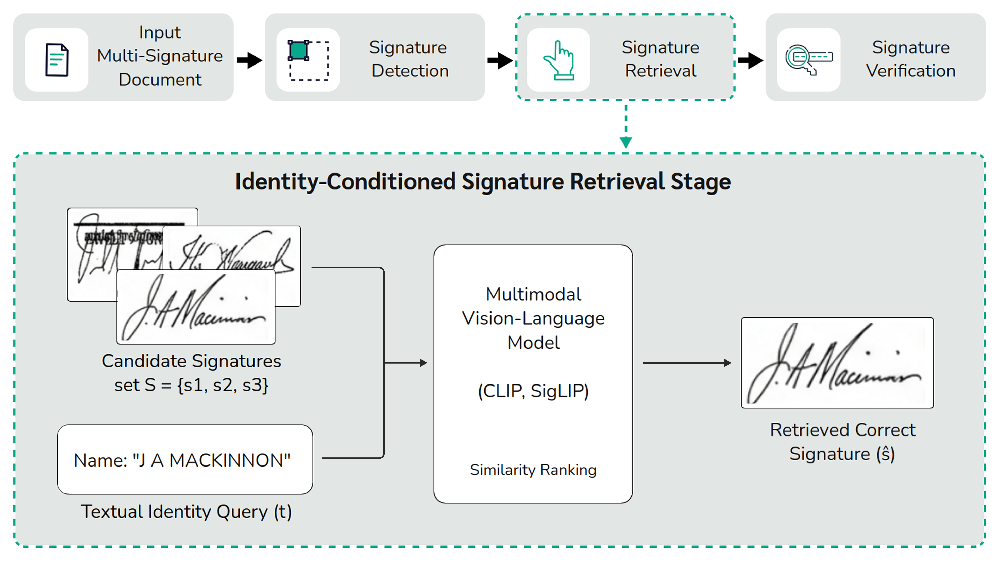

# SignAlign

SignAlign is a modular framework for multimodal alignment between textual identities and handwritten signatures using vision-language models such as CLIP, TinyCLIP, and SigLIP.

## Objective

The goal of this project is to train and evaluate multimodal learning models for the task of **retrieving handwritten signatures conditioned on textual identity**.

Given a textual query (e.g., a person’s name) and a set of candidate signature images, the model aims to identify the signature that corresponds to the given identity.

<p align="center">
  
</p>
<p align="center">
  <em>Figure: Identity-Conditioned Signature Retrieval pipeline integrated into a document processing workflow.</em>
</p>

## Repository Structure

```
src/
├── config/           # Configuration management (dataclasses + YAML)
├── data/             # Dataset handling, augmentations, batch construction
├── models/           # Wrappers for CLIP, TinyCLIP, and SigLIP
├── losses/           # Loss functions (InfoNCE, Sigmoid, Triplet, Combined)
├── training/         # Training loops and schedulers
├── evaluation/       # Metrics and retrieval evaluation
├── explainability/   # Attention rollout and interpretability tools
├── inference/        # Prediction and visualization utilities
└── utils/            # Reproducibility, logging, and utilities

configs/
├── base.yaml         # Base configuration
├── grid/             # Configurations for grid search experiments
├── lr_search/        # Configurations for the learning-rate search
└── internal/         # Configurations for the proprietary-dataset experiments

scripts/
├── run_experiment.py            # Execute a single experiment
├── run_all_experiments.sh       # Run full experimental grid
├── generate_experiment_grid.py  # Generate grid configs (applies best LR)
├── run_lr_search.sh             # Learning-rate search per model
├── analyze_lr_search.py         # Select best LR per model (best_lr.json)
├── run_significance_grid.sh     # Multi-seed runs for significance testing
├── analyze_significance.py      # Statistical significance analysis
├── generate_internal_configs.py # Generate proprietary-dataset configs
├── run_internal_experiments_v2.sh # Run 3 models x 3 schemes on internal data
└── count_parameters.py          # Report parameter counts per model
```

## Installation and Usage

### Installation

```bash
pip install -r requirements.txt
```

### Running Experiments

```bash
python scripts/run_experiment.py --config configs/base.yaml
```

### Debug Mode (Reduced Dataset)

```bash
python scripts/run_experiment.py --config configs/base.yaml --max-samples 100 --epochs 2
```

## Evaluation Metrics

The framework supports a range of evaluation metrics commonly used in retrieval and verification tasks:

- Retrieval Accuracy (with 1, 2, and 3 negative samples)
- Equal Error Rate (EER)
- Area Under the Curve (AUC)
- Recall@k (k = 1, 5, 10)
- Mean Reciprocal Rank (MRR)
- Normalized Discounted Cumulative Gain (nDCG)

## Experimental Grid

The framework includes a predefined grid of experiments exploring different models, training strategies, and loss functions:


| Model         | Variants                                |
| ------------- | --------------------------------------- |
| TinyCLIP      | Frozen, InfoNCE, Combined (λ = 0.1–0.5) |
| CLIP ViT-B/32 | Frozen, InfoNCE, Combined (λ = 0.1–0.5) |
| SigLIP        | Frozen, Sigmoid, Combined (λ = 0.1–0.5) |


Each configuration is evaluated with and without data augmentation.

To execute the full experimental grid:

```bash
bash scripts/run_all_experiments.sh
```

## Training Strategies

### Class Imbalance Handling

The dataset exhibits a long-tailed distribution of signatures per identity. To
mitigate this, training uses a **weighted random sampler** in which each sample
is drawn with probability inversely proportional to the square root of its
identity frequency (`weight_scheme: inv_sqrt`), up-weighting under-represented
individuals and balancing identity exposure during training. It is enabled by
default in every grid configuration and can be disabled with:

```bash
python scripts/run_experiment.py --config configs/grid/<config>.yaml --no-weighted-sampler
```

### Learning-Rate Search

The optimal learning rate is selected per model from {1e-4, 1e-5, 1e-6} using a
simple fine-tuning setup (no augmentation or combined loss):

```bash
bash scripts/run_lr_search.sh
python scripts/analyze_lr_search.py   # writes experiments/lr_search/best_lr.json
```

The selected values (1e-6 for TinyCLIP and CLIP-B/32, 1e-5 for SigLIP) are
automatically applied when generating the grid configurations.

### Statistical Significance

To assess the reliability of the results, the grid is repeated over five random
seeds, and significance is evaluated with paired tests (seed-paired t-test /
Wilcoxon) and Friedman with Nemenyi post-hoc for model comparison:

```bash
bash scripts/run_significance_grid.sh
python scripts/analyze_significance.py
```

## Key Findings

- Fine-tuning provides the largest and most reliable gain over the frozen baseline.
- Under balanced sampling and multi-seed evaluation, **TinyCLIP** achieves the best
overall retrieval accuracy while being the most efficient model (Pareto-optimal),
slightly ahead of CLIP-B/32, with SigLIP behind.
- The triplet component yields marginal, architecture-dependent changes and mainly
reduces variance across seeds.

## Inference

Example usage for computing similarity between a textual identity and a signature image:

```python
from src.inference import SignaturePredictor

predictor = SignaturePredictor.from_experiment("experiments/your_experiment")
similarity = predictor.compute_similarity("João Silva", "signature.png")
```

## Dataset

The dataset used in this work is designed to reflect real-world document processing scenarios, including multiple candidate signatures per document and variability in layout and content.

Access to the dataset is available upon request or through the following link:

**[Dataset Link Placeholder]**

(Note: The dataset URL will be provided after the paper acceptance)

## References

- CLIP: [https://arxiv.org/abs/2103.00020](https://arxiv.org/abs/2103.00020)  
- SigLIP: [https://arxiv.org/abs/2303.15343](https://arxiv.org/abs/2303.15343)  
- TinyCLIP: [https://arxiv.org/abs/2309.12314](https://arxiv.org/abs/2309.12314)

## License

This project is developed as part of a Master's research at the Federal University of Paraná (UFPR). Licensing terms will be defined upon public release.